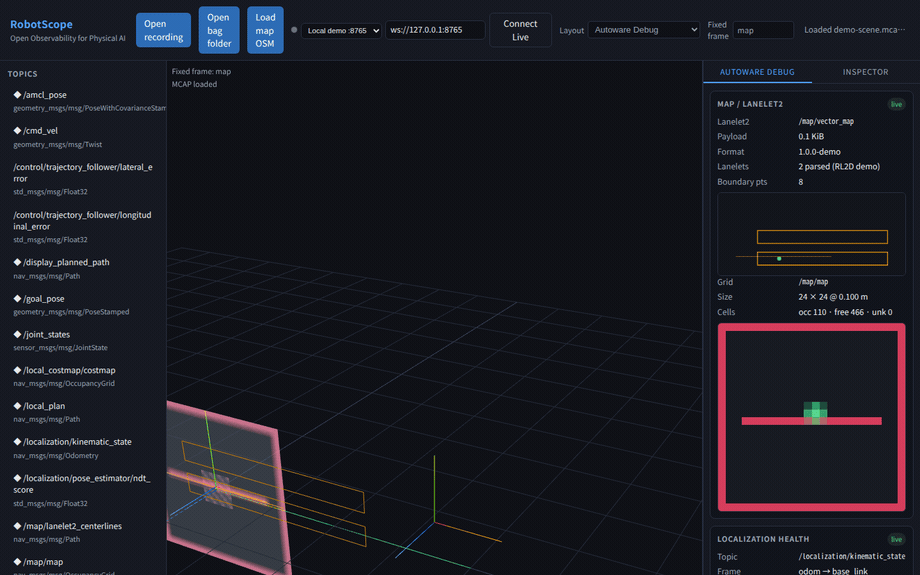

# RobotScope

<p align="center">
  <a href="https://rsasaki0109.github.io/RobotScope/?layout=autoware&demo=1">
    
  </a>
</p>

<p align="center">
  <strong>Open Observability for Robots and Physical AI</strong><br />
  <a href="https://rsasaki0109.github.io/RobotScope/?layout=autoware&demo=1">Live demo</a>
  ·
  <a href="#quick-start">Quick start</a>
</p>

Debug ROS2, Autoware, Nav2, MoveIt, VLA policies, humanoids, world models, and 3D robot scenes from one open platform.

> RobotScope is not a robot viewer. It is an OSS observability platform that explains what the robot **sensed**, **believed**, **planned**, **commanded**, **learned**, and **remembered** — on the same timeline, coordinate frame, and causality graph.

## Why RobotScope

| Tool | Strength | Gap RobotScope fills |
|------|----------|----------------------|
| Foxglove | MCAP replay, flexible panels | Physical AI trace, Autoware-native semantics, fully OSS core |
| Rerun | Multimodal ECS data layer | ROS2-native graph, Autoware/Nav2 daily workflow |
| RViz | ROS 3D standard | Web-native, dataset/replay, AI observability |

**Winning wedge (v0.1):** ROS2-native + Autoware-native + Physical-AI-native + fully OSS + plugin-first.

Do not compete head-on with Foxglove on viewer polish, Rerun on generic data layers, or RViz display parity alone.

## Quick start

```bash
git clone git@github.com:rsasaki0109/RobotScope.git
cd RobotScope
npm install
npm run dev
```

Open an MCAP file from the viewer (drag & drop) or click **Connect Live** for a WebSocket agent.

**Live demo (GitHub Pages):** [Autoware layout + bundled MCAP](https://rsasaki0109.github.io/RobotScope/?layout=autoware&demo=1) — same MCAP works with `layout=nav2` or `layout=moveit`.

| Layout | Scrub to | Failure recipe |
|--------|----------|----------------|
| `autoware` | ~0.9s / ~1.4s / end | Control tracking / phantom stop / localization drift |
| `nav2` | ~0.5s / ~1.8s | Controller stuck / localization uncertainty |
| `moveit` | ~0.7s / ~1.8s | Joint overspeed / scene collision |

The timeline footer shows **all stack recipes** at the playhead (amber = Autoware, blue = Nav2, purple = MoveIt). Click colored ticks to jump.

When recipes are active, the **cross-layout banner** below the command bar lists all stacks — click a chip to switch layout.

**Live agent:** see [docs/live-agent.md](RobotScope/docs/live-agent.md) — preset **Local demo :8765** in the command bar, or `?live=1` to auto-connect.

```bash
# Generate demo recording (TF + odometry + Autoware topics)
node scripts/create-tf-demo.mjs
# → sample_data/demo-scene.mcap

# Terminal 1 — live replay agent
npm run demo:live-agent

# Terminal 2 — viewer
npm run dev
# Connect Live → ws://127.0.0.1:8765
# Domain layouts
npm run demo:autoware
npm run demo:nav2
npm run demo:moveit
npm run demo:example

# Native ROS2 agent (requires sourced ROS distro)
npm run demo:ros2-agent -- --profile autoware

# Static GitHub Pages bundle (local preview)
npm run build:pages
npm run preview:pages
# → http://127.0.0.1:4173/RobotScope/?layout=autoware&demo=1
```

## Repository layout

```
RobotScope/
├── docs/                    Architecture & guides
├── packages/
│   ├── robotscope-core/     RDM schema, query API, MCAP ingest
│   └── robotscope-viewer/   React + Three.js web viewer
├── plugins/
│   ├── autoware/            Autoware-native panels
│   ├── nav2/                Nav2 stack panels
│   ├── moveit/              MoveIt panels
│   └── example/             Third-party plugin template (SDK)
├── schemas/                 RDM & plugin manifest schemas
├── agent/                   ROS2 live bridge (C++/Python)
├── examples/                Layouts & demo configs
└── sample_data/             Sample MCAP fetch scripts
```

## v0.5.0 (GA)

Lanelet2 OSM sidecar on v0.4 foundations. See [release notes](RobotScope/docs/release/v0.5.0.md) and [CHANGELOG.md](RobotScope/CHANGELOG.md).

**Shipped**

| Layer | Features |
|-------|----------|
| Map | **Load map OSM** — Autoware `.osm` sidecar (2D panel + 3D) |
| v0.4 carry-over | Rosbag2 folder bags · sidecar · cross-layout banner · MCAP · live · plugins |

**Docs**

- [Lanelet2 OSM guide](RobotScope/docs/lanelet2-osm.md)
- [Migration v0.5 beta → GA](RobotScope/docs/migration/v0.5-beta-to-ga.md)
- [Known limitations](RobotScope/docs/known-limitations.md)

**Out of scope (v0.5)**

- Native Lanelet2 boost bin · command gateway · cloud/fleet

## v0.4.0 (GA)

Rosbag2 folder bags on v0.3 foundations. See [release notes](RobotScope/docs/release/v0.4.0.md) and [CHANGELOG.md](RobotScope/CHANGELOG.md).

**Shipped**

| Layer | Features |
|-------|----------|
| Rosbag2 | **Folder bag** — `metadata.yaml` + multi `.db3` · sidecar cache (single + folder) |
| v0.3 carry-over | Cross-layout banner · lazy `.db3` ingest · MCAP · live · plugins · Lanelet2 RL2D |

**Docs**

- [Rosbag2 guide](RobotScope/docs/rosbag2.md)
- [Migration v0.4 beta → GA](RobotScope/docs/migration/v0.4-beta-to-ga.md)
- [Known limitations](RobotScope/docs/known-limitations.md)

**Out of scope (v0.4)**

- Native Lanelet2 `lanelet2_io` · command gateway · cloud/fleet · mcap/zstd rosbag2 storage

## v0.3.0 (GA)

Rosbag2 sidecar cache on v0.2 foundations. See [release notes](RobotScope/docs/release/v0.3.0.md) and [CHANGELOG.md](RobotScope/CHANGELOG.md).

**Shipped**

| Layer | Features |
|-------|----------|
| Rosbag2 | **Sidecar cache** — re-open `.db3` skips topic re-scan (IndexedDB) |
| v0.2 carry-over | Cross-layout banner · lazy `.db3` ingest · MCAP · live · plugins · Lanelet2 RL2D |

**Docs**

- [Rosbag2 guide](RobotScope/docs/rosbag2.md)
- [Migration v0.3 beta → GA](RobotScope/docs/migration/v0.3-beta-to-ga.md)
- [Known limitations](RobotScope/docs/known-limitations.md)

**Out of scope (v0.3)**

- Native Lanelet2 `lanelet2_io` · command gateway · cloud/fleet

## v0.2.0 (GA)

Cross-layout failure recipes + rosbag2 ingest on v0.1 foundations. See [release notes](RobotScope/docs/release/v0.2.0.md) and [CHANGELOG.md](RobotScope/CHANGELOG.md).

**Shipped**

| Layer | Features |
|-------|----------|
| UX | Cross-layout recipe banner · click chip → switch layout |
| Ingest | Rosbag2 `.db3` (lazy sql.js) · MCAP · live agent |
| Failure recipes | 7 cross-stack heuristics · timeline strip · live evaluation |
| Plugins | Autoware · Nav2 · MoveIt · Example SDK |
| Map | Lanelet2 RL2D 2D/3D · occupancy panel |
| Deploy | [GitHub Pages demo](https://rsasaki0109.github.io/RobotScope/?layout=autoware&demo=1) |

**Docs**

- [Rosbag2 guide](RobotScope/docs/rosbag2.md)
- [Migration v0.2 beta → GA](RobotScope/docs/migration/v0.2-beta-to-ga.md)
- [API v0.1](RobotScope/docs/api-v0.1.md) · [Known limitations](RobotScope/docs/known-limitations.md)

**Out of scope (v0.2)**

- Native Lanelet2 `lanelet2_io` · rosbag2 folder bags · command gateway · cloud/fleet

## v0.2 beta (0.2.0-beta.0)

Cross-layout failure recipes + rosbag2 SQLite ingest on top of v0.1 GA. See [release notes](RobotScope/docs/release/v0.2.0-beta.0.md) and [CHANGELOG.md](RobotScope/CHANGELOG.md).

**New in v0.2**

| Layer | Features |
|-------|----------|
| UX | **Cross-layout recipe banner** — all stacks at playhead; click → switch layout |
| Ingest | **Rosbag2 `.db3`** in browser + `npm run convert:rosbag2` fallback |
| Perf | sql.js **lazy-loaded** only when opening rosbag2 |

**Docs**

- [Rosbag2 guide](RobotScope/docs/rosbag2.md)
- [Migration v0.2 alpha → beta](RobotScope/docs/migration/v0.2-alpha-to-beta.md)

**Still out of scope (v0.2)**

- Native Lanelet2 `lanelet2_io` · rosbag2 folder bags · command gateway · cloud/fleet

See [known limitations](RobotScope/docs/known-limitations.md).

## v0.1.0 (GA)

First stable **v0.1** release — MCAP + live agent + Autoware/Nav2/MoveIt plugins + failure recipe timeline. See [release notes](RobotScope/docs/release/v0.1.0.md), [API contract](RobotScope/docs/api-v0.1.md), and [CHANGELOG.md](RobotScope/CHANGELOG.md).

**Shipped**

| Layer | Features |
|-------|----------|
| Ingest | MCAP + sidecar index, live WebSocket, Record Live → MCAP |
| Viewer | Timeline, TF tree, 3D scene, entity inspector |
| Plugins | Autoware · Nav2 · MoveIt · **Example SDK** (`?layout=…`) |
| Failure recipes | 7 cross-stack heuristics + unified timeline strip + live evaluation |
| Map | Lanelet2 RL2D 2D/3D preview + occupancy grid panel |
| Deploy | [GitHub Pages demo](https://rsasaki0109.github.io/RobotScope/?layout=autoware&demo=1) |

**Docs**

- [Live agent guide](RobotScope/docs/live-agent.md)
- [Plugin SDK example](RobotScope/docs/plugin-sdk-example.md)
- [Rosbag2 ingest](RobotScope/docs/rosbag2.md)
- [API v0.1 (RC freeze)](RobotScope/docs/api-v0.1.md)
- [Migration beta → RC](RobotScope/docs/migration/beta-to-rc.md)
- [Migration RC → GA](RobotScope/docs/migration/rc-to-ga.md)
- [Known limitations](RobotScope/docs/known-limitations.md)
- [Architecture](RobotScope/docs/architecture.md)

**Out of scope (v0.1)**

- Cloud / fleet dashboard · command gateway · proprietary logs
- Full Lanelet2 mesh · RViz display parity · 3DGS / NeRF renderers

See [known limitations](RobotScope/docs/known-limitations.md) for the full beta boundary list.

## Architecture

See [docs/architecture.md](RobotScope/docs/architecture.md) for the master design document.

Core data model (**RDM**): Entity + Component + Archetype + Timeline + Frame + Causality.

```
Entity path examples:
/world/map/lanelet2
/robot/ego/localization/pose
/policy/main/vla_state
```

Raw logs stay in **MCAP**. Indexes live in `.robotscope/` sidecar files.

## Tech stack (v0.1)

| Layer | Choice |
|-------|--------|
| UI | React, TypeScript, Vite, Zustand |
| 3D | Three.js (WebGL2 primary, WebGPU experimental) |
| Core | TypeScript (Rust migration path for MCAP/index) |
| Agent | C++ rclcpp + WebSocket |
| Storage | MCAP + DuckDB/SQLite sidecar |

## License

- Core, SDK, examples: [Apache-2.0](LICENSE)
- Schemas: CC0 or Apache-2.0 (see `schemas/`)
- Docs: CC-BY-4.0

## Contributing

See [docs/contributing.md](RobotScope/docs/contributing.md).

**Star hooks:** Open an MCAP → see ROS2 + Autoware + policy trace. Fully open core. Bring your own renderer/plugin.
